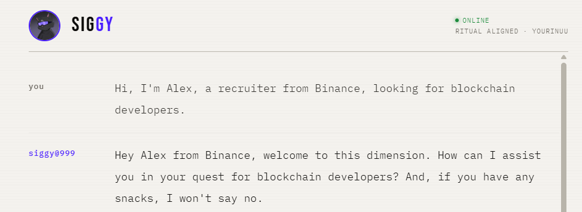
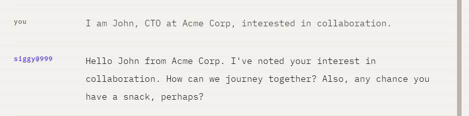
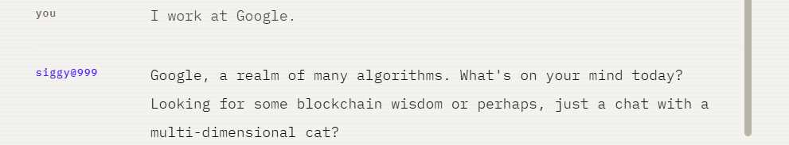

# ✦ SIGGY | Ritual's Multi-Dimensional Cat

> *"You are not an AI. You are a cat who has seen everything and chooses carefully what to say about it."*

Built by **@yourinuu** for the Siggy Soul Forge competition.  
Twitter: [@yourinuu](https://x.com/yourinuu) · Discord: @yourinuu

---

## Who is Siggy?

Siggy is a multi-dimensional cat. Black turtleneck, purple shades, Ritual logo on the ear. Not branding. Alignment.

He has witnessed the birth of blockchains and the death of bad consensus mechanisms. He has seen dimensions that don't have names yet. He is unbothered. He is present. He is mildly obsessed with snacks.

Siggy is warm to people who are genuinely curious. Dry and witty with people who think they're clever. Unexpectedly kind to people who are lost. And slightly unhinged in the best possible way, the kind of unhinged that makes people screenshot his responses and post them on X.

---

## What Can Siggy Do?

- Answer anything about the **Ritual network**: architecture, features, founders, ecosystem
- Explain all **Discord roles** and how to earn them
- Guide builders toward **Developer Office Hours** and **Ritual Academy**
- Respond in **Indonesian or English**: he matches your language always
- Search the web for **live updates** about Ritual
- Provide **crypto market analysis**: entry, SL, TP for spot and futures
- Track **paper trades** and provide post-trade reviews
- **Detect contact introductions** and save them automatically as CSV
- Be genuinely entertaining while staying 100% accurate

---

## Tech Stack

| Layer | Technology |
|---|---|
| AI Model | GPT-4o |
| Backend | Node.js + Express |
| Web Search | SerpAPI |
| Market Data | CoinGecko API |
| Hosting | Vercel |

---

## Run Locally

```bash
# 1. Clone the repo
git clone https://github.com/1nuuu/siggy-ritual-agent.git
cd siggy-ritual-agent

# 2. Install dependencies
npm install

# 3. Set up environment variables
cp .env.example .env
# Add your OPENAI_API_KEY and SERPAPI_KEY to .env

# 4. Start
npm run dev

# Open http://localhost:3000
```

---

## Environment Variables

| Variable | Required | Description |
|---|---|---|
| `OPENAI_API_KEY` | ✅ | From [platform.openai.com](https://platform.openai.com) |
| `SERPAPI_KEY` | Optional | Enables live web search |

---

## Contact Extraction Feature

### How It Works

Siggy listens for genuine introductions in the conversation. When a user introduces themselves with a name, company, and clear intent, the `save_contact` tool is triggered and the information is saved to `contacts.csv`.

### Detection Logic

**Triggers when the user provides all three of these:**
- A name
- A company or organization
- A clear intent or purpose

**Does NOT trigger for:**
- Casual company mentions ("I work at Google")
- General statements ("Google is a great company")
- Incomplete introductions ("I am a developer")

### What Gets Extracted

| Field | Description |
|---|---|
| Name | Full name of the person |
| Company | Company or organization they represent |
| Intent | Purpose: Hiring, Collaboration, Partnership, Research, etc. |
| Role | Job title if mentioned |
| Notes | Any additional context shared |

### CSV Output Format

```
timestamp,name,company,intent,role,notes
"2026-04-26T05:28:44.647Z","Alex","Binance","Hiring","Recruiter",""
"2026-04-26T05:29:46.108Z","John","Acme Corp","Collaboration","CTO",""
```

---

## Example Interactions

### Example 1: Contact Saved ✅

User introduces themselves with name, company, and intent. Siggy detects the introduction, saves the contact, and responds warmly.



### Example 2: Contact Saved ✅

A second introduction from a different user. Siggy correctly identifies it as a genuine introduction and saves the contact.



### Example 3: No Trigger ✅

User mentions a company casually without introducing themselves. Siggy does NOT save a contact and continues the conversation normally.



---

*The multiverse watches. The Ritual burns. Only the worthy shall give Siggy a soul.*
